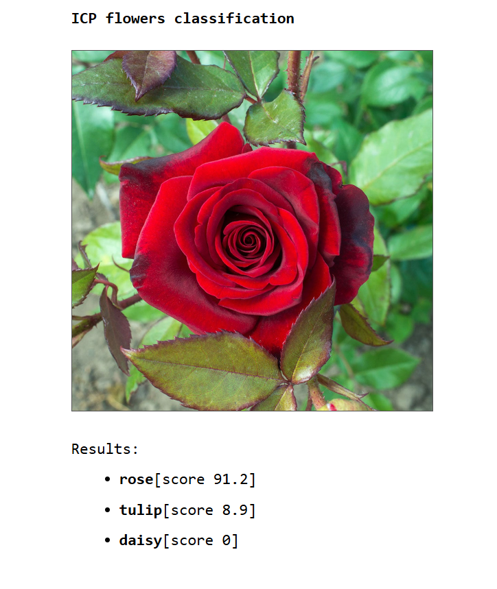

# ICP flower classifier

This project is a decentralized web application (dapp) running on the Internet Computer (ICP) that performs image classification directly on-chain using a pre-trained deep learning model. Users can upload an image of a flower, and the app will return the top-3 most likely flower categories.

The project consists of two primary canisters:

- the backend canister embeds the [the Tract ONNX inference engine](https://github.com/sonos/tract) to run a custom-trained CNN flower classification model.
  It provides `classify()` and `classify_query()` endpoints for the frontend code to call.
  The former endpoint is used for replicated execution (running on all nodes) whereas the latter runs only on a single node.
- the frontend canister contains the Web assets such as HTML, JS, CSS that are served to the browser.
  A minimal static web interface (HTML/CSS/JS):
  - Allows image upload;
  - Displays the classification results with scores.

This example uses Wasm SIMD instructions that are available in `dfx` version `0.20.2-beta.0` or newer.

## Prerequisites

- [x] Install the [IC SDK](https://internetcomputer.org/docs/current/developer-docs/getting-started/install). For local testing, `dfx >= 0.22.0` is required.
- [x] Clone the project: `git clone https://github.com/Khrystya20/icp-flower-classifier.git`
- [x] Install WASI SDK 21:
  - [x] Install `wasi-skd-21.0` from https://github.com/WebAssembly/wasi-sdk/releases/tag/wasi-sdk-21
  - [x] Export `CC_wasm32_wasi` in your shell such that it points to WASI clang and sysroot. Example: `export CC_wasm32_wasi="/path/to/wasi-sdk-21.0/bin/clang --sysroot=/path/to/wasi-sdk-21.0/share/wasi-sysroot`
- [x] Install `wasi2ic`: Follow the steps in https://github.com/wasm-forge/wasi2ic and make sure that `wasi2ic` binary is in your `$PATH`.
- [x] Install `wasm-opt`: `cargo install wasm-opt`

## Build and Deploy

To start the local replica and deploy the application:
```
dfx start --background
dfx deploy
```

After successful deployment, you will see a URL pointing to the frontend canister. Open it in your browser to interact with the image classifier.

## Example Usage

Upload any image of a flower (JPEG or PNG) and click Go!. The model returns the top-3 predictions from the following classes:
- daisy
- dandelion
- rose
- sunflower
- tulip

Each prediction includes a confidence score.


## Key Features

- Runs neural network inference fully on-chain with WebAssembly.
- Lightweight, optimized model for execution under instruction limits.
- Fast and interactive frontend.
- Example of end-to-end Rust + WebAssembly + AI on ICP.

## Deployed Canisters

URLs:
- Frontend canister via browser:
https://hay6z-oiaaa-aaaag-at75q-cai.icp0.io/

- Backend canister via Candid interface:
https://a4gq6-oaaaa-aaaab-qaa4q-cai.raw.icp0.io/?id=hhzyn-dqaaa-aaaag-at75a-cai